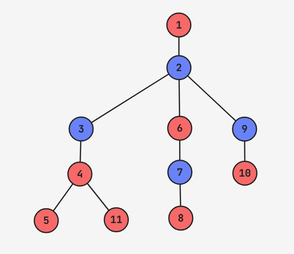

# **【算法题】F. The 67th Tree Problem（第67个树的问题）**
每测试用例时间限制：4 秒
每测试用例内存限制：256 兆字节

### 题目描述
现在泛哺乳动物信息学奥林匹克竞赛（PMOI）季已经结束（Cloud 胜出），猕猴可以继续他的悟道之旅。他要解决的问题越来越难，前世的负担越来越重，而你正以极快的速度失去自由意志，以至于你努力回想，却记不起上一次出于自己的意愿、而非被猕猴胁迫做某件事是什么时候了。对你来说唯一的好处是，一旦你为他解决了以下问题，猕猴会带你免费游览他目前在树上的栖息地。

给定两个整数 \(x\) 和 \(y\) 。

你的任务是构造一棵有 \(x + y\) 个节点、以节点 \(1\) 为根的树，使得：
 - 树中恰好有 \(x\) 个节点的子树\(^{*}\)大小为偶数。
 - 树中恰好有 \(y\) 个节点的子树大小为奇数。

如果存在多个有效树，输出任意一棵。如果不存在这样的树，则输出 “NO”。

### 名词解释
节点 \(u\) 的子树是指在到根节点的简单路径上经过 \(u\) 的所有节点的集合（包括 \(u\) 本身）。

### 输入
每个测试包含多个测试用例。第一行包含测试用例的数量 \(t\)（\(1 \leq t \leq 10^4\)）。接下来是测试用例的描述。

随后的每一行包含两个整数 \(x\) 和 \(y\)（\(0 \leq x, y \leq 2 \cdot 10^5\)，\(1 \leq x + y \leq 2 \cdot 10^5\)）。

保证所有测试用例中 \(x + y\) 的总和不超过 \(2 \cdot 10^5\) 。

### 输出
对于每个查询，根据是否存在符合要求的构造，输出 “YES” 或 “NO” 。输出 “YES” 和 “NO” 时不区分大小写（例如，“yES”、“yes” 和 “Yes” 都将被识别为肯定响应）。

如果输出 “YES”，则输出 \(x + y - 1\) 行，每行包含两个用空格分隔的整数 \(u\) 和 \(v\)，表示节点 \(u\) 和 \(v\) 之间存在一条边。

### 示例
- **输入**
```
7
1 1
2 1
0 3
3 4
0 2
1 0
4 7
```
- **输出**
```
YES
1 2
NO
YES
1 2
1 3
YES
1 2
2 3
3 4
4 5
5 6
6 7
NO
NO
YES
1 2
2 3
3 4
4 5
4 11
2 6
6 7
7 8
2 9
9 10
```

### 说明
在第一个测试中，输出的树是有效的，因为节点 \(1\) 的子树大小为 \(2\)，是偶数，节点 \(2\) 的子树大小为 \(1\)，是奇数。

在第二个测试中，可以证明不存在有效的树。

在第四个测试中，子树大小为偶数的节点是 \([2, 4, 6]\)，子树大小为奇数的节点是 \([1, 3, 5, 7]\) 。

最后一个测试的输出如下图所示，其中蓝色节点的子树大小为偶数，红色节点的子树大小为奇数。


