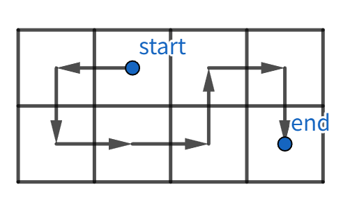
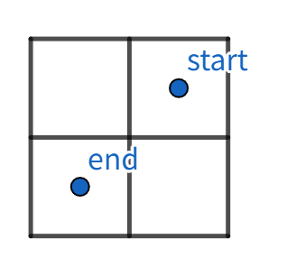

# **【算法题】小红的路径**

时间限制：C/C++/Rust/Pascal 1秒，其他语言2秒
空间限制：C/C++/Rust/Pascal 256 M，其他语言512 M
Special Judge, 64bit IO Format: %lld

### 题目描述 
给定一个 \(2\) 行 \(n\) 列的矩阵，行编号为 \(1\), \(2\)，列编号为 \(1\), \(2\), …, \(n\)。我们使用 \((i, j)\) 表示矩阵中从上往下数第 \(i\) 行和从左往右数第 \(j\) 列的格子。

你初始位于 \((x_1, y_1)\)，目标位置是 \((x_2, y_2)\)。你需要找到一条从初始位置出发，到达目标位置的路径，满足：
- 路径经过矩阵中的每一个格子恰好一次；
- 每一步只能向上下左右四个相邻格子移动。

### 输入描述:
在一行上输入五个整数 \(n\), \(x_1\), \(y_1\), \(x_2\), \(y_2\) (\(1 \leq n \leq 2×10^5\); \(1 \leq x_1\), \(x_2 \leq 2\); \(1 \leq y_1\), \(y_2 \leq n\))。

特殊的，保证 \((x_1, y_1) \neq (x_2, y_2)\)。

### 输出描述:
如果不存在符合条件的路径，请输出 \(-1\)；否则，输出一个长度为 \(2×n - 1\)，仅由字符 \(U\)、\(D\)、\(L\)、\(R\) 组成的字符串，表示符合条件的路径。四个字符分别表示向上、向下、向左、向右移动一格。

如果存在多个解决方案，您可以输出任意一个，系统会自动判定是否正确。注意，自测运行功能可能因此返回错误结果，请自行检查答案正确性。

### 示例1
- **输入**
```
4 1 2 2 4
```
- **输出**
```
LDRRURD
```
- **说明**
在这个样例中，输出描述的移动路径如下图所示：


### 示例2
- **输入**
```
2 1 2 2 1
```
- **输出**
```
-1
```
- **说明**
在这个样例中，矩阵如下图所示。


### 备注:
在几乎全部的情况下，PyPy 的运行速度优于 Python，我们建议您选择对应版本的 PyPy 进行提交、而不是 Python。